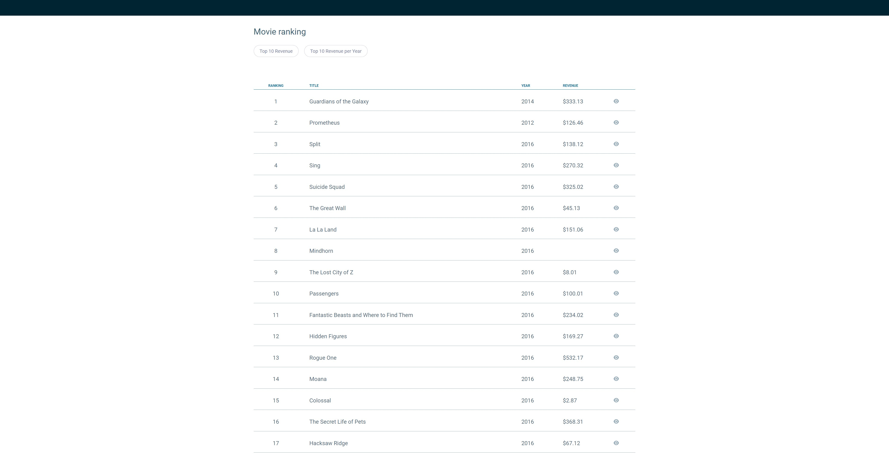
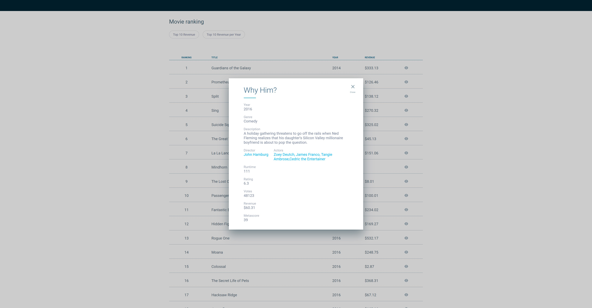

## Summary

This project was made for a movie enthusiast

## How to

- Run development

Make sure the Node is up to date

-- yarn

-- yarn run start

## Preview

# Tools

- React
- Typescript
- Styled Components
- React modal
- Lodash
- Axios - Fetch Library
